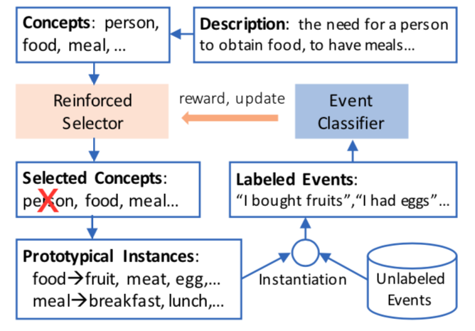

# LeaPI 
**LeaPI** is a zero-shot leanring method to automatically **Lea**rn a classifier from human need descriptions with **P**rototypical **I**nstantiation. It first automatically generates weak labels by instantiating high-level concepts with prototypical instances and then trains a human needs classifier with the weakly labeled data. To filter noisy concepts, it uses a reinforced selection algorithm to choose high-quality concepts for instantiation.

For more details, check out our paper [Learning to Classify Events from Human Needs Category Descriptions](xx). 



## Install

 `conda create -n leapi -y python=3.7`

 `conda activate leapi`

 `./setup.sh`


## Prepare data

  - GoogleNews-vectors-negative300.bin 
    Download and put it in `resources`
  - `probase-data-concept-instance-relations.txt`
    Download Probase and put it in `resources`
  - `event-dict.gz`
    Download event dictionary developed by [Ding&Riloff](http://www.cs.utah.edu/~riloff/pdfs/official-aaai18-ding-riloff.pdf)
    [Download link](https://drive.google.com/file/d/138JDzF9dow35JcmtYyFD5TsupJghI_il/view?usp=sharing)
  - `event-vecs.bin`
    Download event embeddings. An event embeddings are just average of embedding of words in the event. 
    [Download link](https://drive.google.com/file/d/1QcwfqBb0ZsMK0GUjjCjaSz4uPRZSHAnw/view?usp=sharing).
  - `SemEval2015-English-Twitter-Lexicon.pos.json`
    Download [twitter english sentiment lexicon](http://saifmohammad.com/WebDocs/lexiconstoreleaseonsclpage/SemEval2015-English-Twitter-Lexicon.zip).


## Run the code


 - First `cd leapi`
 - Run the following command 
   `python main_learn.py --rl-max-epoch 200 --rl-sample-times 30 --rl-agent-lr 1e-3 --state-feat prodlabel --none-size 300 --wvfpath ../resources/GoogleNews-vectors-negative300.bin --seed 111 --rl-init default`


## Extract candidate concepts

  The `resources` directory contains a pre-extracted candidate concepts. The user can also extract their own candidate concepts using the following scripts. 

  - Install and start redis server 
    ''' >> redis-server  '''

  - Load `Probase` to redis

   ```sh
    cd leapi/prepare-data/
    python probase-redis-server.py
   ```

   ```sh
    python create_event_dict_redis_server.py
   ```

  - Extract candidate concepts

    ``` sh
      cd leapi/concepts
      python generate_concept_candidates.py
    ```


    
